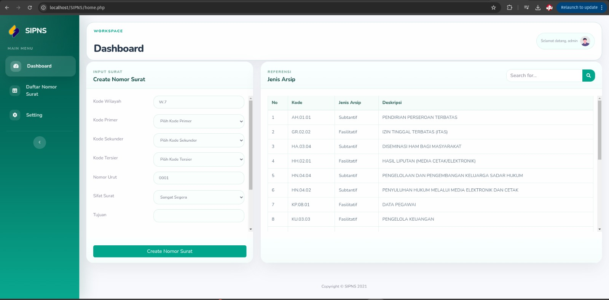

# SIPNS

SIPNS adalah aplikasi web untuk pengambilan nomor surat secara digital. Aplikasi ini membantu proses pembuatan nomor surat, pengelolaan klasifikasi arsip, registrasi pengguna, serta akses dashboard admin dan user melalui antarmuka berbasis PHP dan MySQL.


## Fitur Utama

- Landing page publik untuk pengenalan aplikasi
- Registrasi pengguna dengan password otomatis
- Login user
- Login admin
- Dashboard user untuk membuat nomor surat
- Referensi jenis arsip dan klasifikasi surat
- Halaman daftar nomor surat
- Halaman pengaturan profil
- Panel admin untuk pengelolaan data pendukung

## Teknologi

- PHP
- MySQL / MariaDB
- Bootstrap
- jQuery
- SB Admin 2

## Struktur Halaman Penting

- `index.html` : landing page SIPNS
- `login.php` : login user
- `register.php` : registrasi user
- `home.php` : dashboard user
- `daftarsurat.php` : daftar nomor surat
- `setting.php` : pengaturan user
- `admin/index.php` : login admin
- `admin/home.php` : dashboard admin
- `konek.php` : koneksi database user/public
- `admin/konek.php` : koneksi database admin

## Konfigurasi Database

Saat ini aplikasi menggunakan konfigurasi berikut:

```txt
host     = localhost
username = root
password = lkjsdfjfjf
database = nomor_surat
```

Pastikan database `nomor_surat` sudah tersedia dan tabel-tabel aplikasi sudah diimport sebelum menjalankan sistem.

## Cara Menjalankan

1. Letakkan project di web root, misalnya `htdocs` atau `/var/www/html/`.
2. Buat database `nomor_surat`.
3. Import struktur dan data database aplikasi.
4. Pastikan file koneksi `konek.php` dan `admin/konek.php` sesuai dengan environment Anda.
5. Jalankan web server Apache dan MySQL.
6. Akses aplikasi melalui browser:

```txt
http://localhost/SIPNS/
```

## Preview

### Halaman Login


### Dashboard



## Catatan

- Beberapa tampilan sudah disesuaikan dari template bawaan agar lebih modern.
- Folder `phpmailer/` digunakan untuk kebutuhan email.
- README lama bawaan template masih tersimpan di `Readme.txt`.
